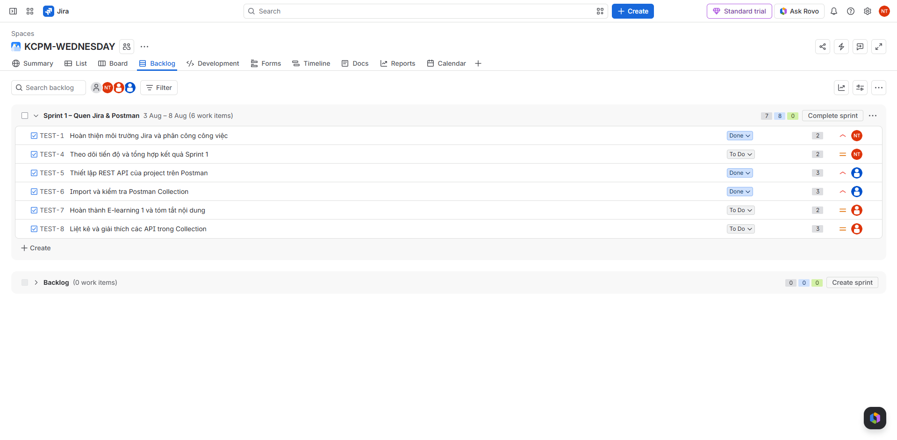

# TEST-1 – Hoàn thiện môi trường Jira

## Người thực hiện:
Nguyễn Chí Toàn – 052205013900

## Mục tiêu:
Thiết lập Jira, tạo Sprint 1 và phân công công việc cho các thành viên trong nhóm.

## Thành viên nhóm:

| Thành viên | Mã số sinh viên |
|---|---|
| Vũ Thành Đạt | 001206040720 |
| Trần Hà Đức Huỳnh | 075206023506 |
| Nguyễn Chí Toàn | 052205013900 |

## Thông tin Sprint:
- Tên Sprint: Sprint 1 – Quen Jira & Postman
- Thời gian: 03/08/2026 – 08/08/2026
- Mục tiêu: Hoàn thiện môi trường Jira, phân công công việc nhóm, hoàn thành E-learning 1 và làm quen với Postman.

## Phân công công việc:
| Jira Task | Công việc | Người thực hiện |
|---|---|---|
| TEST-1 | Hoàn thiện môi trường Jira | Nguyễn Chí Toàn |
| TEST-4 | Theo dõi tiến độ và tổng hợp kết quả | Nguyễn Chí Toàn |
| TEST-5 | Thiết lập REST API của project trên Postman | Vũ Thành Đạt |
| TEST-6 | Import và kiểm tra Postman Collection | Vũ Thành Đạt |
| TEST-7 | Hoàn thành E-learning 1 và tóm tắt nội dung | Trần Hà Đức Huỳnh |
| TEST-8 | Liệt kê và giải thích các API trong Collection | Trần Hà Đức Huỳnh |

## Quy trình thực hiện:
Các thành viên cập nhật trạng thái công việc theo quy trình:
To Do → In Progress → Done
Mỗi công việc chỉ được chuyển sang Done khi đã hoàn thành và có file hoặc ảnh minh chứng.

## Kết quả:
- Đã tạo Sprint 1.
- Đã tạo và đưa 6 công việc vào Sprint.
- Đã phân công người phụ trách cho từng công việc.
- Đã thiết lập Priority và Story point.
- Đã hướng dẫn các thành viên cập nhật trạng thái công việc.
## Ảnh minh chứng:

